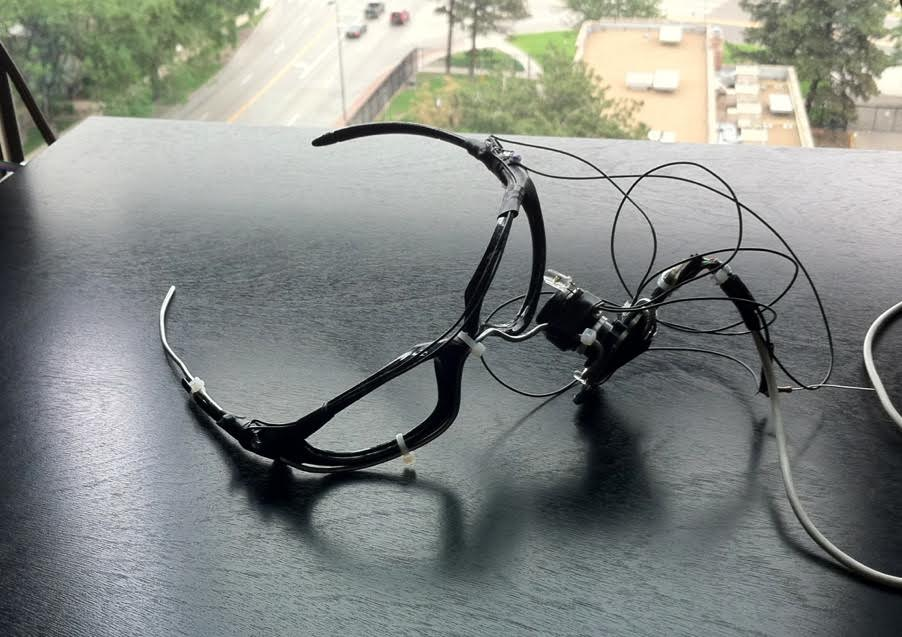
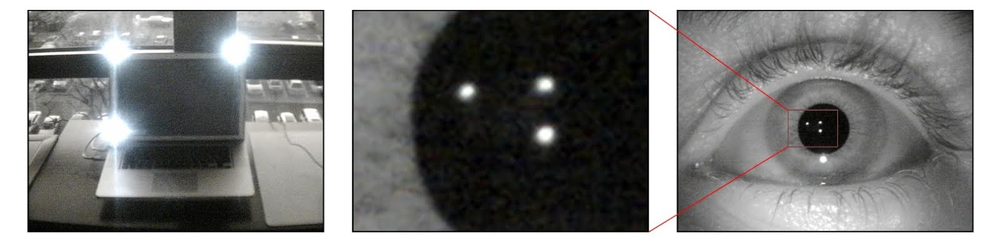
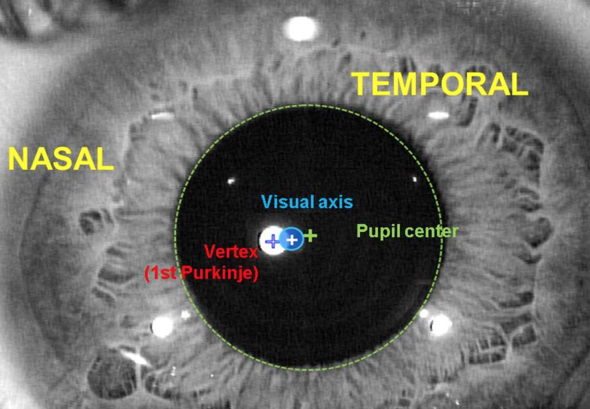
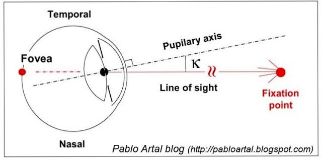

eyetracker
===

Low-cost, open-source eye-tracking system.

Use a cheap, eye-mounted camera, together with few IR lights attached to the
screen for eye tracking.

This is similar to the [Eyewriter][Eyewriter] project, but with the goal of no
user adjustments being necessary for operation.

Requires [OpenCV] and [Openframeworks]. Developed with opencv-2.3.1-3 and
of_preRelease_v007_osx.

Setup
===

Glasses
---

The construction of glasses is described in detail on the [Eyewriter] project
pages. Just like the [Eyewriter] project, glasses are just a pair of frames with
a cheap ps3eye camera attached. The camera should see in infrared, so the
original IR filter is replaced with visible-light-blocking filter. There's a
small NIR LED to illuminate the eye for the camera.

IR Lights
---

Four NIR LEDs are attached at the corners of the screen, for screen coordinate
space reference (these create the reference Purkinje images). This picture has
only three LEDs, but you probably get the idea. More LEDs = more constrained
solution.

History
===

I initially ran across the [Eyewriter] project browsing
[hackaday.com](http://hackaday.com) back when it was first covered; that project
was definitely my point of inspiration to approach the topic seriously. Here is
[a video from my undergraduate study][DU project]. In it you will find some
shots that depict the hardware setup.

My experience with the Eyewriter 1 software left me wanting for more robust
tracking (manual pupil threshold etc); my project was an attempt at creating
something that would work without adjusting (hopefully any) variables or knobs
when the lighting conditions changed.

This project was my first foray into using [OpenCV]; I've been meaning to
convert it to use C++ API calls in order to make it more
readable/usable/portable, but have not gotten around to it yet.

How it works
===

The software looks at the image of the eye and finds the center of the pupil and
four glints corresponding to the corners of the screen (Purkinje images of the
LEDs), and uses that to find the location of the gaze.

To find the center of the pupil, my approach was to analyze the histogram to
identify the upper and lower brightness bounds for the pupil, use those bounds
as threshold values to get the pupil shape, find the convex hull of edge
detected points on the binarized image, then fit an ellipse to it (really just
calling opencv to do all these things). The pupil will be one of the darkest
things in the image, so I just crawl the histogram until the histogram values go
up and then start going down (find first peak=pupil, sort of).

To find the Purkinje images, I just look for the 4 shapes closest to the pupil.

Here's a [video showing what the Purkinje image looks like].

After that, it was just a matter of taking the four LED reflection in
*camera space* and taking the four LED positions in *screen space*, use
[OpenCV homography calculation].

Take the pupil center *in camera space*, and multiply it with that
camera->screen homography matrix, and you get a very stable estimate of gaze in
screen space. Unfortunately, that doesn't represent the line of sight because
the fovea is offset by ~5° from the visual axis (it thinks you're looking a few
inches to the side of where you really are), and as the pupil expands/contracts
this will affect the screenspace estimate as well.

This is where the user calibration comes in: after the camera->screenspace
homography from the pupil-vs-purkinje image LED dots, the user looks at a series
of grid points to correct the estimate into a final screenspace "solution" (in a
piecewise/grid-based fashion, increasing grid resolution can improve accuracy
but also calibration time). I tried compensating for the pupil contraction, but
the angle offset between fovea and visual axis is different between people, so I
assumed uniform lighting conditions. If you want to know more about this angular
offset, I strongly recommend some document like this:
http://www.gatinel.com/recherche-formation/centering-corneal-based-refractive-surgery/
as it has some great diagrams such as:

Here are two videos that shows the pupil tracking in a more debug fashion (two
lighting setups: direct/indirect lighting), that will perhaps make more sense as
a visual aid:

[mscam eyetrack](doc/mscam%20eyetrack.mov)
[mscam eyetrack 2](doc/mscam%20eyetrack%202.mov)

The top left is the binarized pupil with edge highlighted in white. Bottom left
is the ellipse fit to the pupil. Bottom right is the video feed, with the pupil
fix overlaid.

The three histograms from left to right are: whole image, only pupil, and pupil
periphery (roughly iris: it's an expanded bounding box with the pupil
subtracted). These visualizations aided me in developing the algorithm.

[Eyewriter]: http://www.eyewriter.org
[DU project]: https://www.youtube.com/watch?v=nOg1RHQSRzs
[OpenCV]: http://opencv.org
[Openframeworks]: http://openframeworks.cc
[OpenCV homography calculation]: http://docs.opencv.org/modules/calib3d/doc/camera_calibration_and_3d_reconstruction.html#findhomography
[video showing what the Purkinje image looks like]: https://www.youtube.com/watch?v=9GrUyW7yNXI
